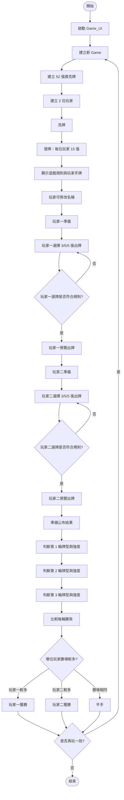

# 遊戲流程圖

```mermaid
flowchart TD
    A([開始]) --> B[啟動 Game_UI]
    B --> C[建立新 Game]
    C --> D[建立 52 張撲克牌]
    D --> E[建立 2 位玩家]
    E --> F[洗牌]
    F --> G[發牌：每位玩家 15 張]
    G --> H[顯示遊戲規則與玩家手牌]
    H --> I[玩家可修改名稱]
    I --> J[玩家一準備]
    J --> K[玩家一選擇 3/5/5 張出牌]
    K --> L{玩家一選牌是否符合規則?}
    L -- 否 --> K
    L -- 是 --> M[玩家一預覽出牌]
    M --> N[玩家二準備]
    N --> O[玩家二選擇 3/5/5 張出牌]
    O --> P{玩家二選牌是否符合規則?}
    P -- 否 --> O
    P -- 是 --> Q[玩家二預覽出牌]
    Q --> R[準備公布結果]
    R --> S[判斷第 1 輪牌型與強度]
    S --> T[判斷第 2 輪牌型與強度]
    T --> U[判斷第 3 輪牌型與強度]
    U --> V[比較每輪勝負]
    V --> W{哪位玩家勝場較多?}
    W -- 玩家一較多 --> X[玩家一獲勝]
    W -- 玩家二較多 --> Y[玩家二獲勝]
    W -- 勝場相同 --> Z[平手]
    X --> AA{是否再玩一局?}
    Y --> AA
    Z --> AA
    AA -- 是 --> C
    AA -- 否 --> AB([結束])
```
