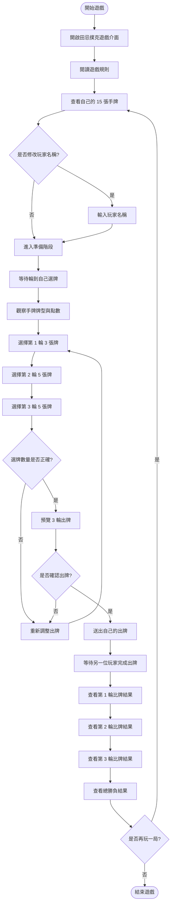

# 玩家遊玩流程圖

```mermaid
flowchart TD
    A([開始遊戲]) --> B[開啟田忌撲克遊戲介面]
    B --> C[閱讀遊戲規則]
    C --> D[查看自己的 15 張手牌]
    D --> E{是否修改玩家名稱?}
    E -- 是 --> F[輸入玩家名稱]
    E -- 否 --> G[進入準備階段]
    F --> G
    G --> H[等待輪到自己選牌]
    H --> I[觀察手牌牌型與點數]
    I --> J[選擇第 1 輪 3 張牌]
    J --> K[選擇第 2 輪 5 張牌]
    K --> L[選擇第 3 輪 5 張牌]
    L --> M{選牌數量是否正確?}
    M -- 否 --> N[重新調整出牌]
    N --> J
    M -- 是 --> O[預覽 3 輪出牌]
    O --> P{是否確認出牌?}
    P -- 否 --> N
    P -- 是 --> Q[送出自己的出牌]
    Q --> R[等待另一位玩家完成出牌]
    R --> S[查看第 1 輪比牌結果]
    S --> T[查看第 2 輪比牌結果]
    T --> U[查看第 3 輪比牌結果]
    U --> V[查看總勝負結果]
    V --> W{是否再玩一局?}
    W -- 是 --> D
    W -- 否 --> X([結束遊戲])
```
